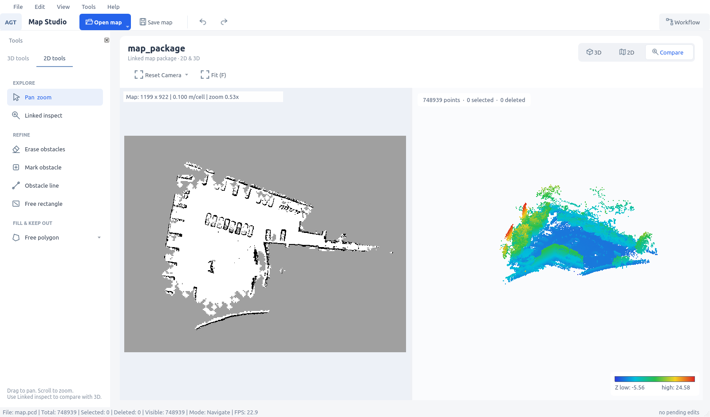

# 当前版本与原仓库的差异说明

更新日期：2026-10-09。本文记录当前代码与原仓库的差异，并单独说明本次 Qt 界面调整。界面暂按当前第二版保留。

## 1. 对照版本与范围

| 项目 | 对照值 |
| --- | --- |
| 原仓库 | [Aldoubt/agt-lio-pgo-mapping](https://github.com/Aldoubt/agt-lio-pgo-mapping) |
| 原仓库 main | `6c40ff8bedab472b5cb0b914088fec1ecd566630`，本次通过 `ls-remote` 核对并 fetch |
| 当前代码仓库 | `/home/xyzkioo/ros2_workspace/src/agt-lio-pgo-mapping` |
| 当前已提交版本 | `d74ce418976b2666110608bd1eb6307a0e9b0b33` |
| 共同祖先 | `c431d62e203ecae45fa1888960af757caf696dca` |
| 本次界面版本 | 以该提交为基线的 UI 修改、新样式文件和构建脚本；随本文一同提交 |

两边已经分叉：共同祖先之后，上游有 4 个独有提交，当前分支有 9 个独有提交。不能把当前版本理解成“最新上游加一层新皮肤”。提交数量也不代表功能优劣。

以两端**已提交文件树**直接比较，差异涉及 142 个文件，增加 9,932 行、减少 3,184 行。此数字包含上游独有功能在当前文件树中的缺失，不代表本地主动删除了全部这些代码。

本次 UI 相对当前 HEAD 的已跟踪差异为 9 个文件、增加 606 行、减少 203 行；另有新文件 `StudioStyle.cpp`、`StudioStyle.hpp`、`scripts/build_map_studio.sh`。上述统计不包含新文件、本说明文档、地图数据、截图和其他未跟踪实验产物。

`agt-lio-pgo-mapping-pristine` 工作目录已有本地修改，不能直接充当干净原仓库。本说明使用 Git 提交文件树对照，运行与文档均以实际仓库 `agt-lio-pgo-mapping` 为准。

## 2. 原有能力与当前新增能力

原仓库已经有 **Qt5/OpenGL Map Studio**、PCD 显示、三维选点删除、二维精炼工具、撤销/重做、地图包打开、工作流以及轻量二维审核。这次是在已有 Qt 应用上完善功能和调整布局，没有从其他前端框架迁移到 Qt，也没有升级到 Qt6。

| 功能 | 原仓库对照版本 | 当前版本的差异 |
| --- | --- | --- |
| 二维／三维对照 | 用堆叠页面切换显示 | 增加水平双视图；左二维、右三维，可调整比例 |
| XY 联动检查 | 没有当前联动选区实现 | 二维点击/框选高亮相同 XY 范围的三维点；三维选点反向高亮二维格子 |
| 独立二维保存 | 有精炼历史与导航图导出、审核确认入口 | 增加独立 Save 2D Map / Save As，不要求先加载 PCD 或完成发布工作流 |
| 二维重新打开 | 原有历史导出能力 | 保存并恢复匹配的编辑历史、禁行区及撤销/重做栈 |
| 二维补标 | 原有清障矩形、障碍线和多边形等工具 | 增加单击 Mark obstacle、Free rectangle；联动选区可直接清除其中障碍 |
| PCD 着色 | Z 高度着色 | 增加任意数值字段着色，以及 `--color-field`、`--color-min`、`--color-max` |
| 三维编辑持久化 | 原有几何规则和删除操作 | 增加精确点编号、完整历史及会话 sidecar；恢复时验证来源和记录 |
| 精炼后端 | 原有几何删除规则 | 支持绑定源 PCD 的 `remove_indices`，避免离散选点被包围盒扩大删除 |
| 异步任务 | 原有外部工具运行流程 | 增加输入与编辑状态快照；处理中输入变化时保留当前编辑，不接受结果为最新 |
| 文件窗口 | 原有文件选择入口 | 统一 Qt 非系统文件窗口，设置列表焦点，改善滚轮和方向键浏览 |
| 算法集成 | 原有通用转换/外部工具流程 | 增加独立处理包及注册执行器，Studio 自动发现兼容算法 |

上述功能变化主要来自当前分支已有提交，并非全部由本次界面美化新增。历史修复与兼容性说明见 [二维编辑修改说明](agt_map_studio_change_notes_20261006.md) 和 [2026-10-08 修复记录](agt_map_studio_fixes_20261008.md)。

### 地图包打开与对照模式

打开的是**地图包目录**。Studio 的 `--package` 用于地图包；bag 建图仍由建图脚本执行。

支持联动的配套布局包括：

```text
map_package/                       发布包/
├── map.pcd                        ├── localization/global_map.pcd
├── manifest.yaml                  └── navigation/
└── navigation/                        ├── map.yaml
    ├── map.yaml                       └── map.pgm
    └── map.pgm
```

使用 **Compare / Ctrl+3** 打开对照，**Ctrl+1 / Ctrl+2** 切换独立三维／二维。首次进入对照按等宽显示，后续保留手动调整的比例。

左侧 **Linked inspect** 检查同 XY 范围所有高度的未删除点，不受三维编辑 Z 窗口限制。红色高亮只是显示覆盖层，不写入 PGM 或删除点云。`Erase obstacles` 修改选区中的二维障碍，空闲和未知保持原样；`Mark obstacle` 可把空闲或未知格子补成障碍。两者均不删除三维点。

单独打开 PCD 或 `map.yaml` 不会建立联动；需要打开包含配套三维、二维数据的完整包。

## 3. 本次 Qt 界面调整

目标是浅色专业工具风格，减少拥挤的工具栏和同时展示的参数，让地图占据主要空间。界面文字目前仍以英语为主。

| 位置 | 当前布局与行为 |
| --- | --- |
| 整体样式 | Fusion、统一浅色调色板、字体和 QSS；图标由 QPainter 绘制 |
| 顶部命令栏 | 打开地图、保存二维图、撤销/重做、Workflow 开关 |
| 左侧工具区 | 分三维／二维页；二维按 Explore、Refine、Fill & Keep Out 分组 |
| 三维参数 | Select/Delete 时显示选择参数；Sphere 时显示半径；启用高度过滤后显示上下限 |
| 二维参数 | 障碍线和标记工具显示宽度；多边形模式显示完成和撤回顶点操作 |
| 中央地图区 | 文件名称、3D / 2D / Compare 切换；相机和适应窗口操作靠近地图 |
| 工作流 | 默认收起；Workflow / Ctrl+W 打开，内部为 Workflow、Parameters、Log 页；外部任务开始时展开 |
| 三维画布 | 浅色背景、简化统计；色标移到右下角，修正渐变被背景覆盖的问题 |
| 二维画布 | 浅色画布和清晰的提示卡片，保留实际黑／白／灰栅格及联动高亮 |

没有引入 ElaWidgetTools、PyQt-Fluent-Widgets 或新的第三方 UI 库；实现继续使用现有 C++ Qt5。布局变化保留当前编辑、保存、联动和外部任务逻辑。

主要代码入口：

| 文件 | 作用 |
| --- | --- |
| [`StudioStyle.cpp`](../apps/agt_map_studio/src/ui/StudioStyle.cpp)、[`StudioStyle.hpp`](../apps/agt_map_studio/src/ui/StudioStyle.hpp) | 新增统一样式、图标、工具行绘制 |
| [`MainWindow.cpp`](../apps/agt_map_studio/src/ui/MainWindow.cpp)、[`MainWindow.hpp`](../apps/agt_map_studio/src/ui/MainWindow.hpp) | 工具分组、参数显隐、视图切换、标题及 dock 布局 |
| [`WorkflowPanel.cpp`](../apps/agt_map_studio/src/ui/WorkflowPanel.cpp) | 工作流、参数和日志页；保留参数恢复的信号阻断 |
| [`PointCloudViewer.cpp`](../apps/agt_map_studio/src/viewer/PointCloudViewer.cpp) | 三维背景、统计、色标和球形预览提示 |
| [`OccupancyViewer.cpp`](../apps/agt_map_studio/src/occupancy/OccupancyViewer.cpp) | 二维画布及提示外观 |
| [`main.cpp`](../apps/agt_map_studio/src/main.cpp)、[`CMakeLists.txt`](../apps/agt_map_studio/CMakeLists.txt) | 应用启动样式与新文件构建接入 |
| [`build_map_studio.sh`](../scripts/build_map_studio.sh) | 新增当前仓库的 Studio 构建入口 |

## 4. 当前分支其他差异

这些是源码分支的已有变化，本次 UI 工作没有继续修改它们。

| 模块 | 差异及使用边界 |
| --- | --- |
| `processing/agt_map_processing` | 新增独立离线组合处理包，包含 OctoMap、检测缓存后处理和地面栅格处理；不依赖 Qt |
| `processing/agt_map_runner` | 新增算法注册、参数校验、通用运行与 `result.json` 协议；算法描述位于安装包的 `share/<package>/algorithms/` |
| 地图配置 | `processing_profile.json` 描述外部数据和资产；算法默认值来自算法包/注册描述，参数可按次覆盖 |
| 处理来源记录 | 注册算法记录输入大小、修改时间、参数和命令，不进行输入内容 SHA256 准入校验；与手工编辑规则的 SHA256 绑定是不同机制 |
| `refinement/agt_map_refinement_core` | 增加精确点编号规则和可选 FAST-LIVO 离线可见性清理；后者带独立输入要求与开源许可 |
| `refinement/agt_map_editor` | 增加 Python/Tk 二维栅格编辑模块，与 Qt Studio 是两个入口 |
| `sensor/agt_livox_self_return_filter` | 新增 CustomMsg 固定盒形自身回波过滤器；默认关闭，原始录包保留 |
| `sensor/agt_livox_self_filter_bridge` | 新增车体自过滤链路的消息桥接；`--self-filter` 与 `--vehicle-return-filter` 互斥 |
| `bringup/agt_mapping_bringup` | 回放和实机共用 `mapping_nodes.py` 构建处理节点，接入可选过滤链路及就绪检查 |
| 包元数据、迁移清单、文档 | 同步调整作者、维护与路径信息；这类差异不等于算法行为变化 |

离线组合处理使用匹配的检测、轨迹和停车等资产；当前缓存后处理不重新执行 CenterPoint 神经网络推理。单独一张 XYZ PCD 不包含完整流程所需证据。安装环境中的算法注册数量可以不同，不能把本机可选算法都当作这个 Git 仓库自带的源码。

进一步接口见 [处理包](../processing/agt_map_processing/README.md)、[执行器](../processing/agt_map_runner/INTERFACE.md)、[自身回波过滤](../sensor/agt_livox_self_return_filter/README.md) 和 [FAST-LIVO 可见性清理](../refinement/agt_map_refinement_core/livo_visibility.md)。后者的 MIT 许可在 [UPSTREAM_VISIBILITY_LICENSE](../refinement/agt_map_refinement_core/UPSTREAM_VISIBILITY_LICENSE)，不是本次 UI 引入的库。

## 5. 尚未合入的上游变化与已发现问题

以下是对照最新上游后发现的差距，不应记作本次 UI 优化成果。

| 上游已有内容 | 当前状态 |
| --- | --- |
| `TraversabilityGridBuilder`、`projection_traversability.yaml` 及相关测试 | 当前源码没有合入；审核入口也没有上游默认 Bunker v1 traversability 配置选择逻辑 |
| `mapping_map_release prepare/publish` | 当前没有对应 `map_release.py`；Studio 的外部发布流程不等同于此上游流程 |
| YHS 专用实机入口、`--robot yhs_v1` | 当前没有对应 launch/CLI 分支；不能直接照搬上游 YHS 命令 |
| FAST-LIO2 实机稳定性修复 | 当前配置仍与上游不同，具体如下 |

[`fastlio2_mid360.yaml`](../bringup/agt_mapping_bringup/config/fastlio2_mid360.yaml) 的关键值：

| 参数 | 最新上游 | 当前源码 |
| --- | ---: | ---: |
| `scan_resolution` | 0.15 | 0.5 |
| `map_resolution` | 0.3 | 0.5 |
| `cube_len` | 300 | 200 |
| `det_range` | 60 | 300 |
| `move_thresh` | 1.5 | 1.5 |

上游配置注明局部地图移动阈值应小于立方体边长的一半；当前值计算为 `1.5 × 300 = 450`，大于 `200 / 2 = 100`，与该修复约束不一致。这是后续实机/回放前需要核查的稳定性风险。本文核实的是源码差异，尚未检查实际 ROS 安装层是否使用其他配置，也未重跑建图验证其影响。

另外，当前 [`scripts/edit_grid_map.sh`](../scripts/edit_grid_map.sh) 调用 `tools/agt-grid-map-editor/start.sh`，但本次检查该目录不存在。Python/Tk 模块源码存在，不代表此一键脚本可用。本文保留现状，记录待修复项。

当前环境缺少 `agt_map_manager`，Studio 正式发布按钮受外部工具可用性限制；完整发布/激活未验证。手工三维删除也尚未接入现有注册导航算法，遇到不兼容会明确拒绝。

## 6. 构建、打开地图与验证

在实际仓库内构建并运行：

```bash
cd /home/xyzkioo/ros2_workspace/src/agt-lio-pgo-mapping
scripts/build_map_studio.sh
scripts/map_studio.sh --package /path/to/map_package
```

构建使用现有 Qt 5.15.3、ROS 2 Humble 和工作区依赖，输出到 `.studio-build`、`.studio-install`、`.studio-log`。构建脚本只构建 Studio，不代替处理包或精炼后端的安装。启动脚本最后加载本仓库 `.studio-install`，以使用当前界面；已有窗口需重启才会加载新版本。

可独立使用 `--pcd /path/to/map.pcd` 或 `--map /path/to/map.yaml`。二维保存为新建/既有编辑输出目录，不直接覆盖打开的原始地图包。三维编辑通过干净点云导出或精炼输出交付。

本次已验证的范围：

- Studio 构建成功；12 个 CTest 目标中 **11 通过、1 跳过**。跳过项为 `test_navigation_algorithms_smoke`，原因是未设置 `AGT_MAP_PROFILE`。
- 自动回归包含独立二维保存/恢复、会话和异步输入保护、XY 联动、文件窗口及编辑模型。
- 原生 X11 + 软件 OpenGL 检查通过：真实工具按钮、多边形下拉菜单、参数显隐、三种视图切换和工作流展开/收起。
- 打开现有 `exports/AGT_lizhi_navigation_20261008_v2/map_package`，读取 **748,939 点**及 **1199 × 922** 栅格，分辨率 **0.100 m/cell**；此次预览未修改或保存源包。

证据：[CTest 记录](assets/map_studio_20261009/test-results.txt)、[原生交互记录](assets/map_studio_20261009/native-check.log)。配套截图及记录已复制到 `docs/assets/map_studio_20261009/`，随本文交付。



本次没有重跑真实数据集算法、bag 建图、实机导航或正式地图发布，也没有做性能基准。单个地图包成功显示和 UI 回归通过，不代表上述链路全部通过。Studio 二维读取仍限制为 PGM、trinary、零原点旋转；禁行区需要导航端显式接入。

## 7. 后续复核与交付

本次交付包含本说明、新样式文件、构建脚本、UI 修改和上述文档附件。基线及差异统计保留文档创建时的快照，最终交付提交号以 Git 历史为准。`exports/`、`artifacts/`、`third_party/` 等目录含大量本地数据或试验内容，未纳入本次提交。新机器复现离线算法还需对应依赖、算法注册及外部数据资产。

复核本文基线可使用固定 SHA，避免后续上游更新改变比较口径：

```bash
git diff --stat 6c40ff8bedab472b5cb0b914088fec1ecd566630 d74ce418976b2666110608bd1eb6307a0e9b0b33
git diff --name-status 6c40ff8bedab472b5cb0b914088fec1ecd566630 d74ce418976b2666110608bd1eb6307a0e9b0b33
git diff d74ce418976b2666110608bd1eb6307a0e9b0b33 -- apps/agt_map_studio
git status --short
```

`git diff` 不包含未跟踪新文件，因此交付 UI 时应同时携带 `StudioStyle.cpp`、`StudioStyle.hpp` 和 `scripts/build_map_studio.sh`。下一次同步上游应分别评估 UI/编辑功能、建图配置和发布链路，避免只按提交数量判断合并结果。
